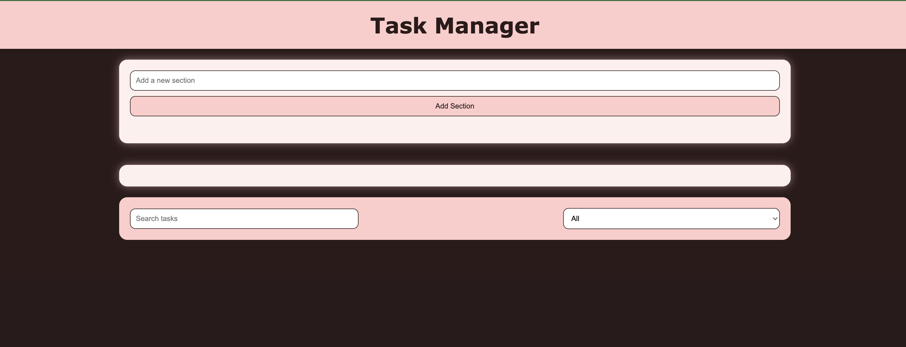
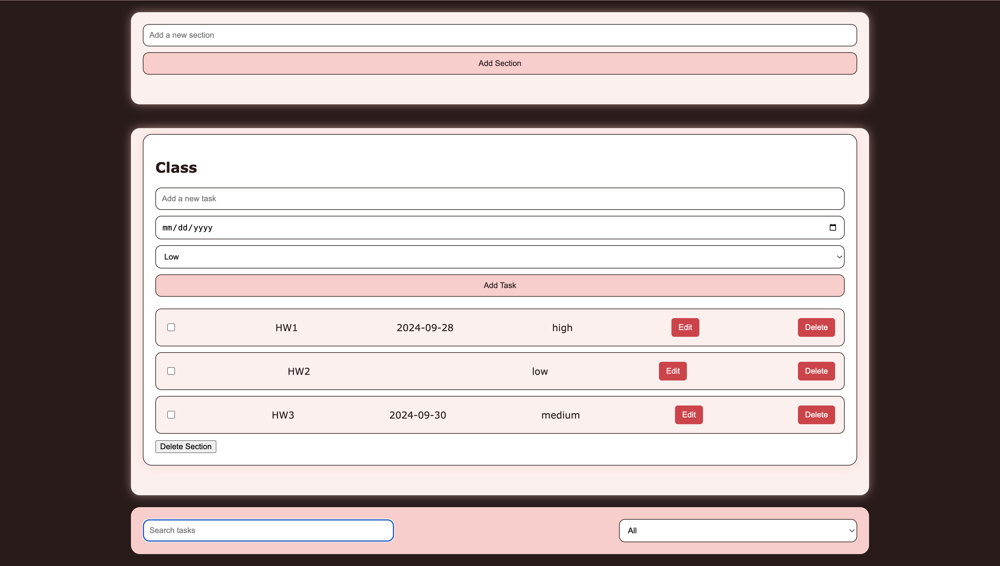

# Task Management App

## Overview
This project is a responsive task management app designed with a soft pastel aesthetic and built using HTML, CSS, and JavaScript. The app allows users to add, track, and manage tasks, featuring interactive sections and forms that adapt well to both desktop and mobile devices.

The styling emphasizes user-friendliness with a pastel pink and brown color palette, rounded corners, and subtle animations to create a pleasant user experience.

## Features
- **Responsive Design**: The layout adapts seamlessly to different screen sizes (mobile, tablet, desktop).
- **Task Management**: Users can add, edit, and delete tasks.
- **Form Validation**: Input fields are validated before submission to ensure accuracy.
- **Interactive UI**: Animations and hover effects enhance the user experience.
- **Task Status**: Mark tasks as completed and visually distinguish completed tasks.

## Technologies Used
- **HTML5**: Structure of the web app.
- **CSS3**: For styling and layout, including Flexbox and responsive design techniques.
- **JavaScript (ES6)**: To add interactivity and manage the task logic.

## Setup Instructions

Clone the repository:

```bash
git clone https://github.com/your-username/To-Do-App.git
```

Navigate to the project folder:

```bash
cd To-Do-App
```

Open the `index.html` file in your preferred browser.

## File Structure

```bash
.
├── index.html         # Main HTML file
├── style.css          # Stylesheet for the project
├── app.js             # JavaScript logic for task management
└── README.md          # Project documentation
```

## Usage
- Open the app in a browser by double-clicking the `index.html` file.
- Use the form to add a task by entering task details and clicking the "Add Task" button.
- Manage your tasks by marking them as completed or deleting them.
- Use the search filter to quickly find tasks based on criteria.

## Customization
- **Colors and Aesthetics**: You can easily change the color scheme in the `style.css` file. Look for the color variables at the top of the stylesheet to update the theme to your preference.
- **Task Logic**: The task management logic is located in `app.js`, where you can modify the task creation, deletion, and completion processes.

## Screenshots




## Contributing
Contributions are welcome! Feel free to fork this repository and submit a pull request.

1. Fork the repository.
2. Create a new branch:  
   ```bash
   git checkout -b feature-branch
   ```
3. Make your changes and commit them:  
   ```bash
   git commit -m 'Add new feature'
   ```
4. Push to the branch:  
   ```bash
   git push origin feature-branch
   ```
5. Open a Pull Request.

## License
This project is licensed under the MIT License. See the LICENSE file for details.